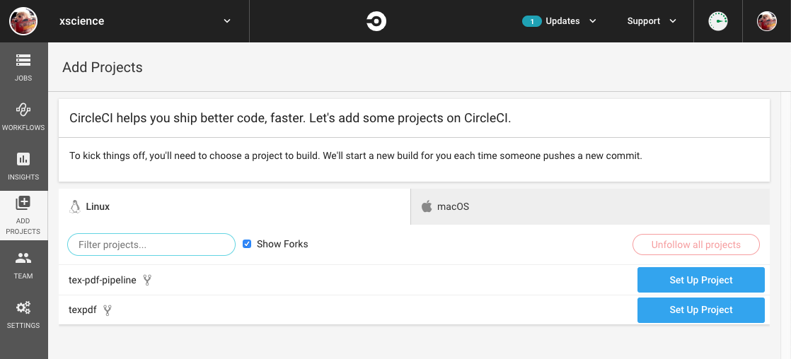
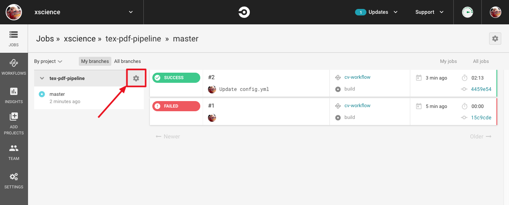
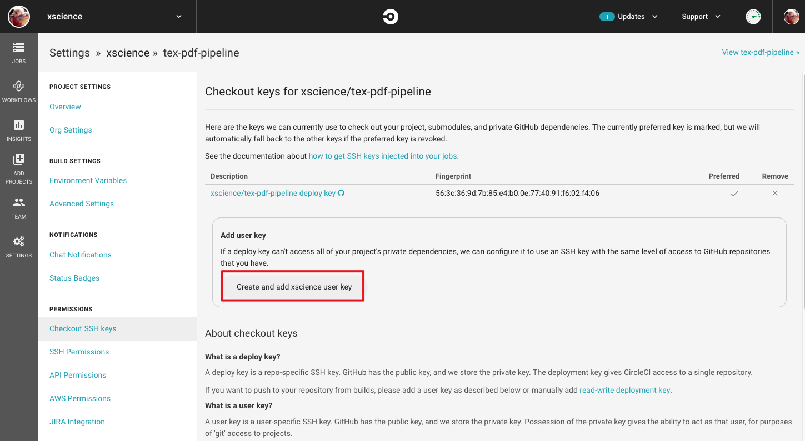
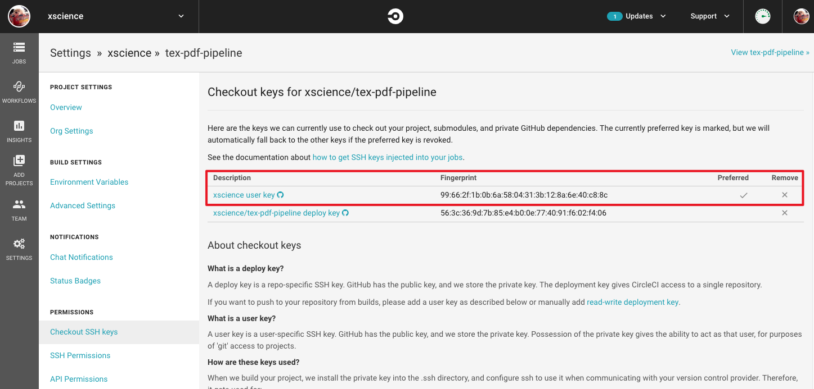
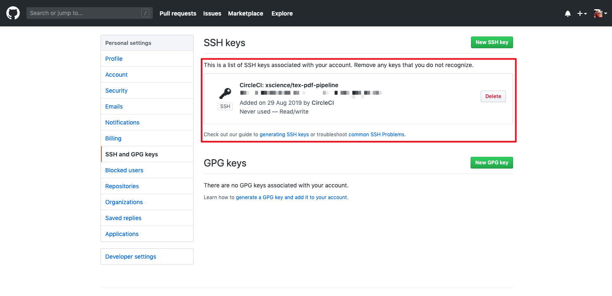
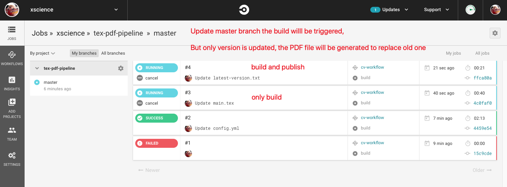
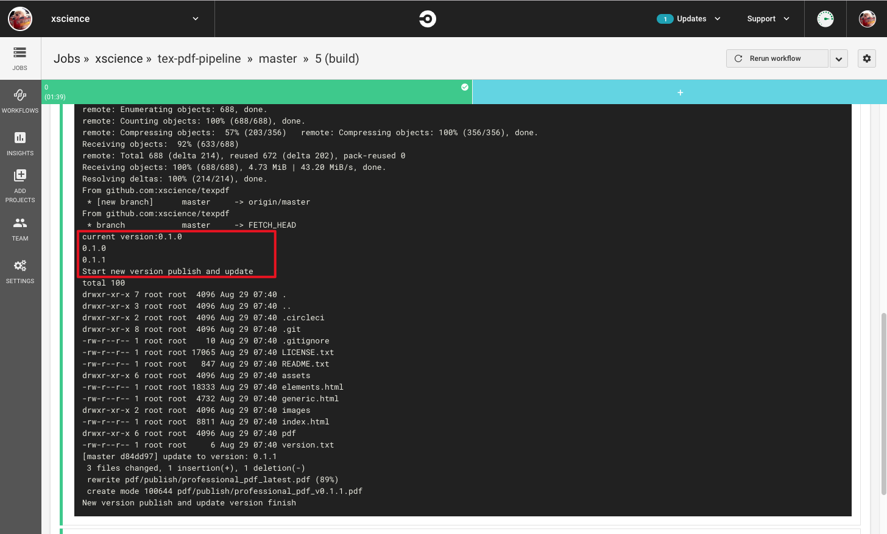

# Tex PDF Publish Pipeline

An CI/CD Tex PDF Publishing Pipeline

## What's Tex PDF Publish Pipeline

The main purpose of this project is used to publish the Latex PDF file automatically. Such as CV or Papers.

For example: [My CV Page](https//mengxin.science/me).

Based on this system, you can publish the PDF file from the Tex source code easily.

## Technologies Stack

The related tools are as follows:

1. Overleaf: Professional online Tex editor (accquire ShareLatex)
2. CircleCI: Oniine CI/CD build server which provides free private repo build
3. [koppor/texlive:v1.5.0 Docker Image](https://github.com/dante-ev/docker-texlive): One of best Tex build docklized environment
4. [PDF.js](https://mozilla.github.io/pdf.js/): Javascript library to render PDF professionally
5. GitHub Page: Free to server static HTML files
6. [html5up](https://html5up.net/): Free CC spiffy HTML5 site templates

## How to use

### Prepare 2 Repos

1. **REPO1**: Tex Source Code Repo (It could be private). It can be forked from this [repo](https://github.com/xmeng1/tex-pdf-pipeline).
2. **REPO2**: Published Web Repo (It should be public). It can be forked form the [corresponding demo repo](https://github.com/xmeng1/texpdf).

### Update Repo1

#### MUST DO

There are several things you must update in the file of [.circleci/gh_publish.sh](.circleci/gh_publish.sh)

```bash
G_GIT_EMAIL=x.meng@outlook.com  # update to your email address which will be used as commit author
G_GIT_NAME="Xin Meng"           # update to your name which will be used as commit author
PUBLISH_GIT_REPO=git@github.com:xmeng1/texpdf.git # update to your repo for publish web page with PDF files
PUBLISH_GIT_BRANCH=master       # the branch used in the publish repo
```

#### MAY DO

If you fork **REPO2** from the demo repo, just keep these parameters.

The value of these variables are based on the default REPO1 and REPO2, if you want to update them, you MUST update corresponding environment context config.

##### `PDF_NAME_PREFIX`

If you change this name, you must update the published HTML and PDF.js corresponding link. You can search `professional_pdf_latest` in the demo repo and check all usages.

```javascript
var url = '/texpdf/pdf/publish/professional_pdf_latest.pdf';
```

##### `TEX_BUILD_PDF_NAME`

If you change this name, you need to change `main.tex` with same name or update `[.circleci/config.yml](.circleci/config.yml)` corresponding build command `xelatex main.tex` to specific outhput pdf file name.

##### `PDF_FILE_STORAGE_FOLDER`

This is relative path of PDF files stored on the REPO2. If you change this name, you must update the published HTML and PDF.js corresponding link.

### Import REPO1 to CircleCI and config

#### setup projects

You can login CircleCi by using the GitHub account and setup the projects as follows:



#### config project to authorised permission

Click the config of specific project:



Authorised








### Start to test build

You just need to update the version file [latest-version.txt](.circleci/latest-version.txt) and the circleci build will be triggered automatically.



You can check the build log:



### Import the REPO1 to Overleaf

You can use the Overleaf to edit the Latex source code by using the import feature. (This feature is not free, but you can get it by reference friends see this link: [Overleaf Bonus](https://www.overleaf.com/user/bonus))
